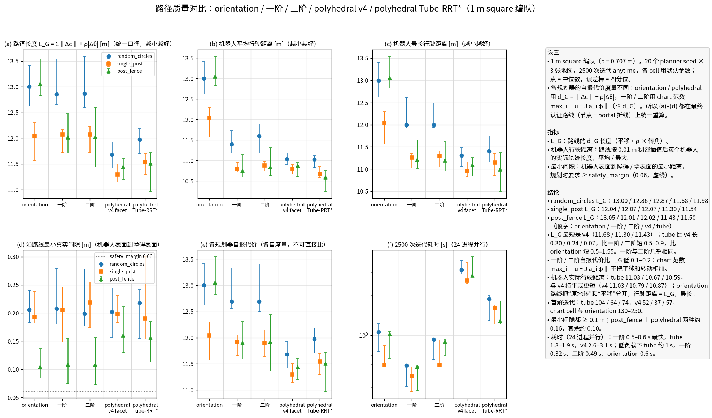

# 各 cell 模型的路径质量对比

`scripts/compare_cell_costs.py --seeds 20 --iterations 2500`。每条最终路线在同一口径下重算；表中为中位数 [四分位]。

| 地图 | cell | 成功率 | 首解迭代 | 自报代价 | L_G [m] | 机器人平均 / 最长行驶 [m] | 最小间隙 [m] | 耗时 [s] |
| --- | --- | --- | --- | --- | --- | --- | --- | --- |
| `random_circles` | orientation | 1.00 | 218 | 13.00 | 13.00 [12.63, 13.41] | 13.00 / 13.00 | 0.206 [0.184, 0.240] | 1.06 |
| `random_circles` | first_order | 1.00 | 236 | 12.69 | 12.86 [12.66, 13.54] | 11.40 / 12.00 | 0.208 [0.180, 0.279] | 0.59 |
| `random_circles` | second_order | 1.00 | 252 | 12.69 | 12.87 [12.61, 13.59] | 11.60 / 12.00 | 0.199 [0.177, 0.278] | 0.93 |
| `random_circles` | polyhedral | 1.00 | 52 | 11.68 | 11.68 [11.42, 11.93] | 11.03 / 11.31 | 0.202 [0.157, 0.244] | 3.12 |
| `random_circles` | polyhedral_tube | 1.00 | 104 | 11.98 | 11.98 [11.71, 12.18] | 11.03 / 11.41 | 0.218 [0.155, 0.242] | 1.88 |
| `single_post` | orientation | 1.00 | 131 | 12.04 | 12.04 [11.57, 12.30] | 12.04 / 12.04 | 0.193 [0.182, 0.238] | 0.60 |
| `single_post` | first_order | 1.00 | 150 | 11.92 | 12.07 [11.72, 12.17] | 10.79 / 11.26 | 0.206 [0.149, 0.246] | 0.49 |
| `single_post` | second_order | 1.00 | 150 | 11.90 | 12.07 [11.73, 12.23] | 10.88 / 11.29 | 0.219 [0.175, 0.255] | 0.60 |
| `single_post` | polyhedral | 1.00 | 37 | 11.30 | 11.30 [11.15, 11.50] | 10.79 / 10.95 | 0.198 [0.183, 0.231] | 2.59 |
| `single_post` | polyhedral_tube | 1.00 | 64 | 11.54 | 11.54 [11.29, 11.70] | 10.67 / 11.15 | 0.190 [0.154, 0.300] | 1.61 |
| `post_fence` | orientation | 1.00 | 170 | 13.05 | 13.05 [12.83, 13.54] | 13.05 / 13.05 | 0.103 [0.085, 0.137] | 1.02 |
| `post_fence` | first_order | 1.00 | 186 | 11.89 | 12.01 [11.72, 12.47] | 10.75 / 11.21 | 0.108 [0.074, 0.156] | 0.57 |
| `post_fence` | second_order | 1.00 | 186 | 11.91 | 12.02 [11.44, 12.61] | 10.83 / 11.20 | 0.108 [0.073, 0.156] | 0.89 |
| `post_fence` | polyhedral | 1.00 | 57 | 11.43 | 11.43 [11.21, 11.61] | 10.87 / 11.09 | 0.160 [0.130, 0.211] | 2.82 |
| `post_fence` | polyhedral_tube | 1.00 | 74 | 11.50 | 11.50 [10.97, 11.72] | 10.59 / 10.99 | 0.155 [0.113, 0.185] | 1.27 |
