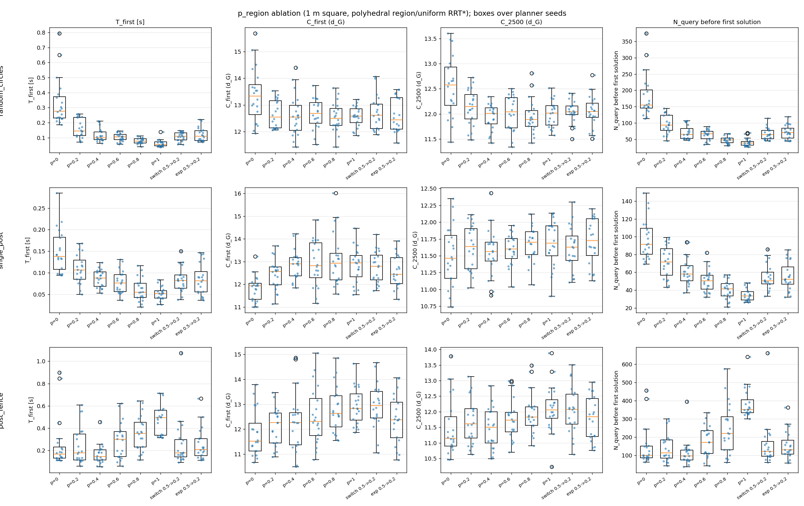
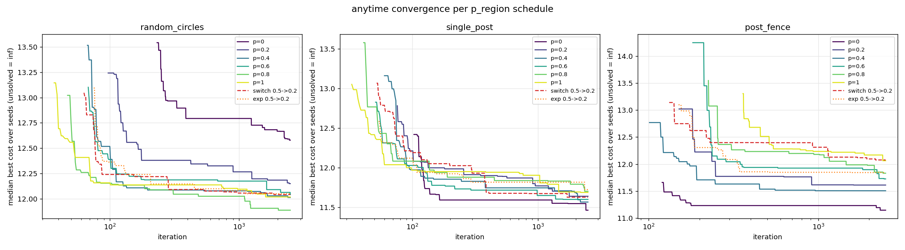

# p_region 消融：polyhedral region/uniform RRT*

- 编队：square，相邻机器人 1 m（rho = 0.707 m），机器人半径 0.113 m，安全余量 0.06 m
- 每个配置：20 个 planner seed（0..19），anytime 2500 次迭代；random_circles 地图 seed 7
- p=
：常数 p_region；switch：首解前 0.5、之后 0.2；exp：0.2 + 0.3 e^{-0.002 t}
- T_first：首解墙钟时间；C_first / C_final：首解 / 最终 d_G 路径代价；N_query：位姿 proximity 查询次数（每次查询返回所有 robot-obstacle 距离，= 构造的 cell 数），pair：robot-obstacle 距离对总数
- 总耗时 86 s；复现：`../env-rebuilt/bin/python scripts/ablate_region_sampling.py --seeds 20 --iterations 2500`

均值 ± 标准差（T_first / C_first / N_query_first 只统计成功的 seed）。

## random_circles

| 调度 | 成功率 | T_first [s] | 首解迭代 | N_query 首解前 | C_first | C_2500 | N_query 总 | pair 查询 | region 节点 | 节点 | 时间 [s] |
| --- | --- | --- | --- | --- | --- | --- | --- | --- | --- | --- | --- |
| p=0 | 1.00 | 0.332 ± 0.154 | 274 ± 114 | 182 ± 65 | 13.36 ± 0.99 | 12.55 ± 0.59 | 1917 ± 89 | 122701 ± 5672 | 0 ± 0 | 1920 ± 89 | 4.51 ± 0.66 |
| p=0.2 | 1.00 | 0.162 ± 0.063 | 110 ± 40 | 96 ± 28 | 12.65 ± 0.51 | 12.13 ± 0.35 | 2140 ± 28 | 136928 ± 1784 | 275 ± 15 | 1918 ± 28 | 4.45 ± 0.71 |
| p=0.4 | 1.00 | 0.116 ± 0.042 | 76 ± 25 | 70 ± 21 | 12.61 ± 0.75 | 11.94 ± 0.25 | 2260 ± 27 | 144640 ± 1719 | 374 ± 16 | 1667 ± 32 | 4.12 ± 0.68 |
| p=0.6 | 1.00 | 0.104 ± 0.026 | 64 ± 15 | 64 ± 15 | 12.67 ± 0.55 | 12.02 ± 0.34 | 2290 ± 16 | 146534 ± 1021 | 427 ± 7 | 1608 ± 46 | 4.11 ± 0.63 |
| p=0.8 | 1.00 | 0.080 ± 0.018 | 47 ± 11 | 48 ± 10 | 12.54 ± 0.53 | 11.95 ± 0.33 | 2299 ± 18 | 147158 ± 1143 | 459 ± 14 | 1580 ± 40 | 3.96 ± 0.51 |
| p=1 | 1.00 | 0.063 ± 0.023 | 39 ± 12 | 40 ± 12 | 12.56 ± 0.38 | 12.00 ± 0.26 | 2300 ± 23 | 147184 ± 1490 | 467 ± 14 | 1548 ± 45 | 3.86 ± 0.57 |
| switch 0.5->0.2 | 1.00 | 0.108 ± 0.029 | 68 ± 22 | 66 ± 18 | 12.70 ± 0.62 | 12.05 ± 0.21 | 2135 ± 31 | 136650 ± 1994 | 282 ± 11 | 1904 ± 35 | 4.55 ± 0.76 |
| exp 0.5->0.2 | 1.00 | 0.120 ± 0.045 | 75 ± 24 | 72 ± 21 | 12.62 ± 0.62 | 12.04 ± 0.31 | 2172 ± 25 | 139040 ± 1576 | 351 ± 12 | 1876 ± 32 | 4.55 ± 0.73 |

## single_post

| 调度 | 成功率 | T_first [s] | 首解迭代 | N_query 首解前 | C_first | C_2500 | N_query 总 | pair 查询 | region 节点 | 节点 | 时间 [s] |
| --- | --- | --- | --- | --- | --- | --- | --- | --- | --- | --- | --- |
| p=0 | 1.00 | 0.150 ± 0.049 | 113 ± 31 | 98 ± 22 | 11.82 ± 0.54 | 11.50 ± 0.43 | 2154 ± 25 | 43080 ± 506 | 0 ± 0 | 2157 ± 25 | 4.79 ± 0.75 |
| p=0.2 | 1.00 | 0.109 ± 0.033 | 77 ± 23 | 72 ± 18 | 12.42 ± 0.63 | 11.63 ± 0.33 | 2232 ± 21 | 44647 ± 418 | 204 ± 11 | 1944 ± 24 | 4.42 ± 0.68 |
| p=0.4 | 1.00 | 0.086 ± 0.019 | 63 ± 16 | 61 ± 15 | 12.85 ± 0.63 | 11.56 ± 0.34 | 2320 ± 19 | 46400 ± 372 | 290 ± 13 | 1612 ± 30 | 3.70 ± 0.63 |
| p=0.6 | 1.00 | 0.078 ± 0.026 | 50 ± 12 | 51 ± 13 | 12.93 ± 0.98 | 11.59 ± 0.22 | 2344 ± 17 | 46874 ± 332 | 338 ± 13 | 1469 ± 51 | 3.54 ± 0.56 |
| p=0.8 | 1.00 | 0.061 ± 0.026 | 39 ± 10 | 40 ± 10 | 13.09 ± 1.13 | 11.67 ± 0.25 | 2358 ± 15 | 47163 ± 304 | 366 ± 14 | 1412 ± 41 | 3.26 ± 0.54 |
| p=1 | 1.00 | 0.051 ± 0.015 | 34 ± 7 | 34 ± 7 | 12.83 ± 0.75 | 11.68 ± 0.34 | 2364 ± 17 | 47285 ± 346 | 387 ± 10 | 1382 ± 52 | 3.29 ± 0.49 |
| switch 0.5->0.2 | 1.00 | 0.084 ± 0.028 | 55 ± 14 | 55 ± 14 | 12.75 ± 0.69 | 11.62 ± 0.32 | 2234 ± 18 | 44670 ± 351 | 209 ± 11 | 1934 ± 27 | 4.40 ± 0.71 |
| exp 0.5->0.2 | 1.00 | 0.084 ± 0.036 | 56 ± 17 | 55 ± 16 | 12.56 ± 0.66 | 11.72 ± 0.34 | 2240 ± 18 | 44804 ± 364 | 270 ± 9 | 1862 ± 24 | 4.21 ± 0.63 |

## post_fence

| 调度 | 成功率 | T_first [s] | 首解迭代 | N_query 首解前 | C_first | C_2500 | N_query 总 | pair 查询 | region 节点 | 节点 | 时间 [s] |
| --- | --- | --- | --- | --- | --- | --- | --- | --- | --- | --- | --- |
| p=0 | 1.00 | 0.252 ± 0.222 | 216 ± 217 | 146 ± 105 | 11.84 ± 0.90 | 11.48 ± 0.89 | 2067 ± 89 | 90939 ± 3897 | 0 ± 0 | 2070 ± 89 | 4.71 ± 0.64 |
| p=0.2 | 1.00 | 0.244 ± 0.164 | 179 ± 119 | 142 ± 77 | 12.13 ± 0.74 | 11.70 ± 0.71 | 2188 ± 34 | 96290 ± 1478 | 238 ± 11 | 1930 ± 30 | 4.50 ± 0.68 |
| p=0.4 | 1.00 | 0.165 ± 0.087 | 124 ± 91 | 113 ± 72 | 12.27 ± 1.17 | 11.45 ± 0.64 | 2293 ± 19 | 100899 ± 816 | 328 ± 15 | 1632 ± 24 | 3.78 ± 0.68 |
| p=0.6 | 1.00 | 0.287 ± 0.160 | 184 ± 92 | 174 ± 83 | 12.54 ± 1.12 | 11.77 ± 0.64 | 2319 ± 28 | 102025 ± 1216 | 379 ± 14 | 1562 ± 42 | 3.76 ± 0.61 |
| p=0.8 | 1.00 | 0.354 ± 0.154 | 256 ± 153 | 246 ± 136 | 12.80 ± 0.90 | 11.94 ± 0.64 | 2323 ± 28 | 102199 ± 1240 | 399 ± 14 | 1504 ± 48 | 3.71 ± 0.61 |
| p=1 | 1.00 | 0.477 ± 0.131 | 396 ± 99 | 385 ± 80 | 12.94 ± 0.72 | 12.10 ± 0.74 | 2325 ± 23 | 102287 ± 1028 | 407 ± 16 | 1496 ± 53 | 3.48 ± 0.63 |
| switch 0.5->0.2 | 1.00 | 0.259 ± 0.214 | 178 ± 161 | 159 ± 126 | 12.94 ± 0.89 | 12.05 ± 0.74 | 2194 ± 33 | 96547 ± 1444 | 274 ± 21 | 1920 ± 60 | 4.48 ± 0.67 |
| exp 0.5->0.2 | 1.00 | 0.253 ± 0.139 | 175 ± 94 | 155 ± 75 | 12.39 ± 0.96 | 11.79 ± 0.69 | 2210 ± 22 | 97231 ± 972 | 318 ± 12 | 1879 ± 27 | 3.91 ± 0.51 |

## 图

