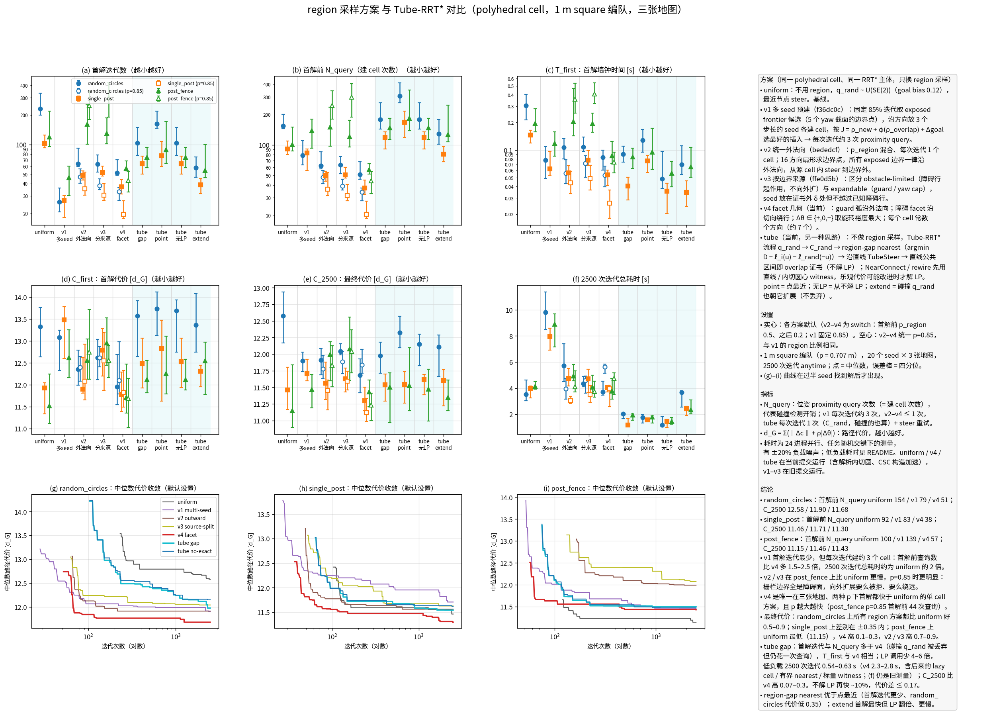

# region 采样方案对比

`scripts/compare_region_schemes.py --seeds 20 --iterations 2500`。
每个方案在对应提交的 git worktree 中运行（同地图、同 seed、同迭代数），T_first / N_query 在规划器外统一测量。表中为中位数 [四分位]。

| 地图 | 方案 | 成功率 | 首解迭代 | 首解前 N_query | T_first [s] | C_first | C_2500 | N_query | LP 调用 | 耗时 [s] |
| --- | --- | --- | --- | --- | --- | --- | --- | --- | --- | --- |
| `random_circles` | uniform | 1.00 | 232 [200, 334] | 154 [145, 202] | 0.305 [0.214, 0.403] | 13.33 [12.64, 13.76] | 12.58 [12.17, 12.93] | 1919 | 1702 | 3.54 |
| `random_circles` | v1 multi-seed | 1.00 | 26 [20, 36] | 79 [64, 110] | 0.077 [0.049, 0.109] | 13.08 [12.33, 13.25] | 11.90 [11.73, 12.03] | 7219 | 3096 | 9.81 |
| `random_circles` | v2 outward | 1.00 | 64 [60, 92] | 62 [58, 86] | 0.107 [0.080, 0.133] | 12.36 [11.99, 12.79] | 11.91 [11.69, 12.08] | 2162 | 1648 | 5.72 |
| `random_circles` | v3 source-split | 1.00 | 63 [52, 78] | 64 [52, 77] | 0.108 [0.097, 0.139] | 12.62 [12.12, 13.03] | 12.04 [11.99, 12.16] | 2140 | 2077 | 4.36 |
| `random_circles` | v4 facet | 1.00 | 52 [49, 70] | 51 [46, 68] | 0.083 [0.061, 0.100] | 11.96 [11.55, 12.69] | 11.68 [11.42, 11.93] | 2158 | 3070 | 3.71 |
| `random_circles` | v2 outward p=0.85 | 1.00 | 47 [40, 56] | 48 [41, 56] | 0.056 [0.043, 0.079] | 12.40 [12.08, 12.65] | 11.78 [11.64, 11.97] | 2482 | 1460 | 3.95 |
| `random_circles` | v3 source-split p=0.85 | 1.00 | 38 [35, 44] | 39 [36, 46] | 0.072 [0.051, 0.087] | 12.61 [12.41, 12.87] | 11.89 [11.71, 12.04] | 2294 | 2079 | 4.60 |
| `random_circles` | v4 facet p=0.85 | 1.00 | 33 [27, 36] | 34 [28, 37] | 0.053 [0.040, 0.067] | 12.10 [11.79, 12.98] | 11.84 [11.71, 12.07] | 2379 | 6239 | 5.64 |
| `random_circles` | tube gap | 1.00 | 104 [78, 149] | 178 [144, 262] | 0.090 [0.074, 0.110] | 13.57 [12.65, 13.92] | 11.98 [11.71, 12.18] | 3038 | 745 | 2.05 |
| `random_circles` | tube point | 1.00 | 162 [146, 218] | 306 [262, 412] | 0.128 [0.095, 0.167] | 13.73 [13.13, 14.11] | 12.33 [12.10, 12.57] | 3166 | 777 | 1.75 |
| `random_circles` | tube no-exact | 1.00 | 104 [78, 149] | 178 [144, 262] | 0.049 [0.038, 0.096] | 13.69 [12.74, 13.93] | 12.15 [11.82, 12.30] | 3038 | 0 | 1.20 |
| `random_circles` | tube extend | 1.00 | 58 [46, 75] | 130 [102, 178] | 0.069 [0.054, 0.111] | 13.37 [12.74, 14.08] | 12.11 [11.67, 12.29] | 4250 | 1576 | 3.67 |
| `single_post` | uniform | 1.00 | 102 [92, 125] | 92 [80, 110] | 0.145 [0.119, 0.165] | 11.93 [11.34, 12.05] | 11.46 [11.17, 11.80] | 2154 | 760 | 3.99 |
| `single_post` | v1 multi-seed | 1.00 | 27 [18, 30] | 83 [56, 92] | 0.062 [0.053, 0.097] | 13.48 [12.60, 13.78] | 11.71 [11.60, 11.92] | 7090 | 1366 | 7.96 |
| `single_post` | v2 outward | 1.00 | 48 [43, 54] | 50 [44, 55] | 0.056 [0.043, 0.068] | 11.90 [11.81, 12.63] | 11.56 [11.31, 11.88] | 2279 | 764 | 4.75 |
| `single_post` | v3 source-split | 1.00 | 52 [48, 60] | 50 [47, 60] | 0.078 [0.068, 0.098] | 12.79 [12.20, 13.28] | 11.63 [11.43, 11.79] | 2229 | 958 | 4.71 |
| `single_post` | v4 facet | 1.00 | 37 [31, 44] | 38 [32, 45] | 0.054 [0.041, 0.061] | 11.78 [11.39, 12.29] | 11.30 [11.15, 11.50] | 2236 | 1480 | 4.05 |
| `single_post` | v2 outward p=0.85 | 1.00 | 36 [30, 52] | 36 [32, 53] | 0.044 [0.034, 0.059] | 12.09 [11.66, 12.93] | 11.45 [11.16, 11.61] | 2480 | 812 | 3.06 |
| `single_post` | v3 source-split p=0.85 | 1.00 | 30 [27, 40] | 32 [28, 41] | 0.049 [0.037, 0.068] | 12.54 [11.87, 13.19] | 11.60 [11.46, 11.74] | 2352 | 924 | 3.50 |
| `single_post` | v4 facet p=0.85 | 1.00 | 20 [18, 27] | 20 [19, 28] | 0.026 [0.018, 0.037] | 11.83 [11.49, 12.33] | 11.12 [10.99, 11.34] | 2216 | 1654 | 3.96 |
| `single_post` | tube gap | 1.00 | 64 [50, 76] | 118 [91, 134] | 0.041 [0.029, 0.051] | 12.48 [11.93, 13.06] | 11.54 [11.29, 11.70] | 2895 | 234 | 1.17 |
| `single_post` | tube point | 1.00 | 76 [60, 108] | 168 [119, 216] | 0.076 [0.057, 0.088] | 12.83 [11.63, 13.47] | 11.54 [11.26, 11.73] | 2852 | 302 | 1.59 |
| `single_post` | tube no-exact | 1.00 | 64 [50, 76] | 118 [91, 134] | 0.036 [0.020, 0.044] | 12.53 [11.94, 13.06] | 11.62 [11.39, 11.70] | 2895 | 0 | 1.45 |
| `single_post` | tube extend | 1.00 | 39 [32, 45] | 81 [68, 96] | 0.035 [0.024, 0.046] | 12.31 [11.95, 12.44] | 11.60 [11.22, 11.77] | 3762 | 332 | 2.44 |
| `post_fence` | uniform | 1.00 | 119 [95, 220] | 100 [87, 151] | 0.195 [0.158, 0.281] | 11.52 [11.12, 12.24] | 11.15 [10.90, 11.84] | 2096 | 1040 | 4.16 |
| `post_fence` | v1 multi-seed | 1.00 | 46 [30, 60] | 139 [92, 180] | 0.118 [0.086, 0.157] | 12.62 [12.17, 13.25] | 11.46 [11.19, 11.70] | 7134 | 2275 | 8.88 |
| `post_fence` | v2 outward | 1.00 | 161 [100, 253] | 150 [98, 238] | 0.205 [0.143, 0.468] | 12.56 [12.13, 13.05] | 11.99 [11.60, 12.19] | 2248 | 1182 | 4.92 |
| `post_fence` | v3 source-split | 1.00 | 130 [102, 186] | 122 [95, 176] | 0.195 [0.157, 0.252] | 12.95 [12.45, 13.52] | 12.08 [11.60, 12.56] | 2194 | 1592 | 4.08 |
| `post_fence` | v4 facet | 1.00 | 57 [54, 68] | 57 [52, 65] | 0.086 [0.071, 0.125] | 11.71 [11.36, 12.47] | 11.43 [11.21, 11.61] | 2232 | 2628 | 3.76 |
| `post_fence` | v2 outward p=0.85 | 1.00 | 248 [179, 345] | 247 [180, 345] | 0.360 [0.253, 0.532] | 12.74 [12.13, 13.71] | 11.83 [11.51, 12.12] | 2482 | 1662 | 4.10 |
| `post_fence` | v3 source-split p=0.85 | 1.00 | 302 [189, 423] | 299 [189, 404] | 0.408 [0.322, 0.538] | 12.56 [12.17, 12.90] | 12.04 [11.72, 12.37] | 2323 | 1426 | 3.75 |
| `post_fence` | v4 facet p=0.85 | 1.00 | 43 [33, 53] | 44 [33, 54] | 0.074 [0.056, 0.095] | 11.69 [11.03, 12.14] | 11.23 [11.00, 11.41] | 2290 | 3693 | 4.76 |
| `post_fence` | tube gap | 1.00 | 74 [58, 93] | 148 [114, 184] | 0.084 [0.063, 0.105] | 12.12 [11.82, 12.56] | 11.50 [10.97, 11.72] | 2980 | 530 | 1.95 |
| `post_fence` | tube point | 1.00 | 88 [64, 171] | 184 [138, 350] | 0.095 [0.062, 0.173] | 12.26 [11.79, 13.10] | 11.53 [11.15, 12.10] | 3028 | 524 | 1.79 |
| `post_fence` | tube no-exact | 1.00 | 74 [58, 93] | 148 [114, 184] | 0.056 [0.040, 0.075] | 12.12 [11.88, 12.58] | 11.47 [11.00, 11.77] | 2980 | 0 | 1.46 |
| `post_fence` | tube extend | 1.00 | 54 [46, 100] | 126 [108, 248] | 0.066 [0.051, 0.107] | 12.54 [11.78, 12.97] | 11.35 [11.15, 11.61] | 3948 | 959 | 2.33 |

## 低负载耗时

3 进程并行、每方案 6 个 seed（`--seeds 6 --workers 3 --chunk 2 --schemes ...`），比上表的 24 进程测量更接近单独运行的耗时。

| 地图 | 方案 | T_first [s] | 2500 次迭代耗时 [s] | LP 调用 | C_2500 |
| --- | --- | --- | --- | --- | --- |
| `random_circles` | uniform | 0.177 | 2.47 [2.37, 2.53] | 1810 | 12.78 |
| `random_circles` | v4 facet | 0.064 | 2.79 [2.70, 2.83] | 3169 | 11.94 |
| `random_circles` | tube gap | 0.033 | 0.63 [0.62, 0.64] | 338 | 11.71 |
| `random_circles` | tube point | 0.032 | 0.57 [0.56, 0.57] | 340 | 12.10 |
| `random_circles` | tube no-exact | 0.026 | 0.53 [0.53, 0.54] | 0 | 11.81 |
| `random_circles` | tube extend | 0.018 | 1.15 [1.12, 1.16] | 947 | 11.84 |
| `single_post` | uniform | 0.072 | 2.29 [2.28, 2.30] | 722 | 11.83 |
| `single_post` | v4 facet | 0.031 | 2.27 [2.22, 2.32] | 1514 | 11.46 |
| `single_post` | tube gap | 0.017 | 0.54 [0.54, 0.56] | 81 | 11.31 |
| `single_post` | tube point | 0.016 | 0.49 [0.48, 0.50] | 96 | 11.28 |
| `single_post` | tube no-exact | 0.015 | 0.52 [0.52, 0.53] | 0 | 11.46 |
| `single_post` | tube extend | 0.011 | 0.84 [0.84, 0.84] | 168 | 11.65 |
| `post_fence` | uniform | 0.102 | 2.37 [2.33, 2.40] | 1122 | 11.16 |
| `post_fence` | v4 facet | 0.058 | 2.70 [2.67, 2.72] | 2690 | 11.46 |
| `post_fence` | tube gap | 0.018 | 0.58 [0.56, 0.59] | 165 | 11.32 |
| `post_fence` | tube point | 0.021 | 0.53 [0.52, 0.53] | 174 | 11.53 |
| `post_fence` | tube no-exact | 0.016 | 0.53 [0.52, 0.54] | 0 | 11.38 |
| `post_fence` | tube extend | 0.022 | 0.93 [0.92, 0.94] | 406 | 11.52 |
