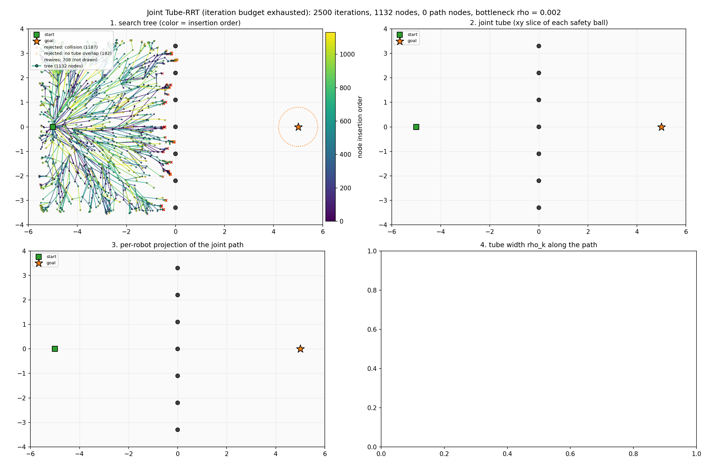
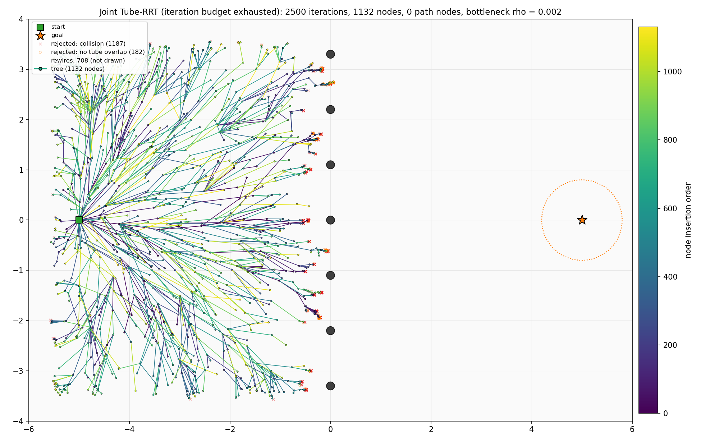
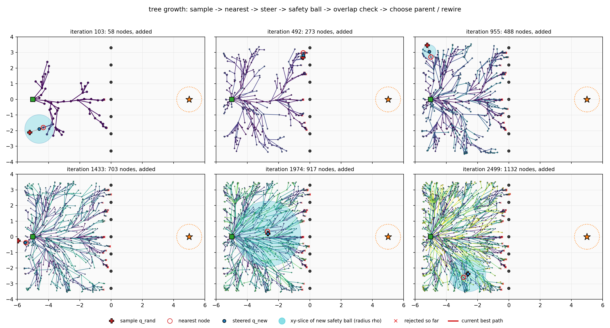
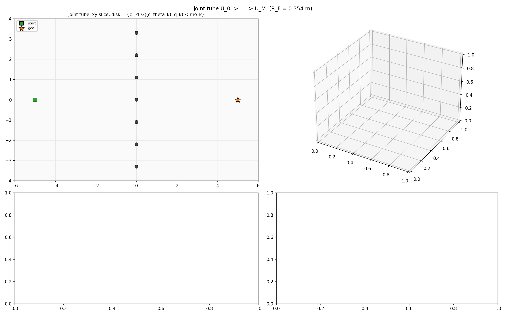
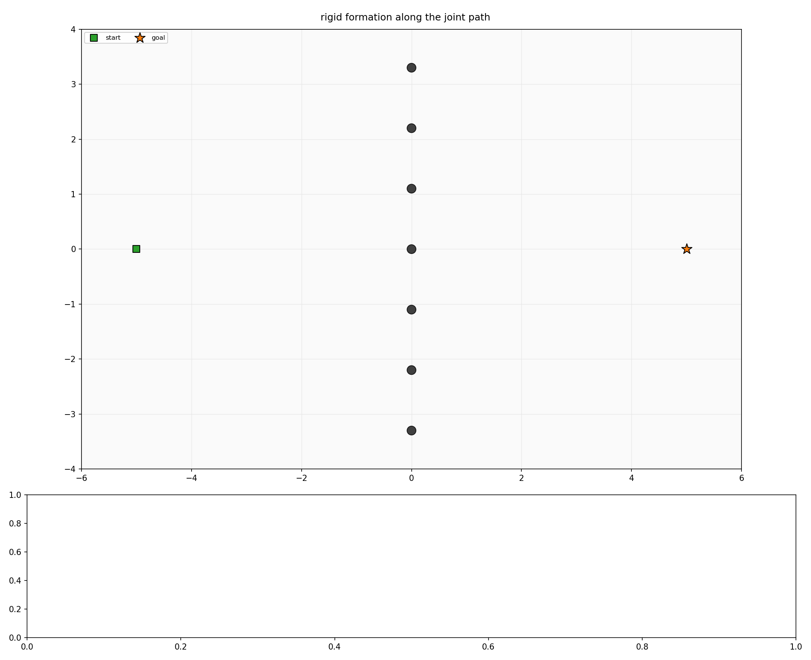
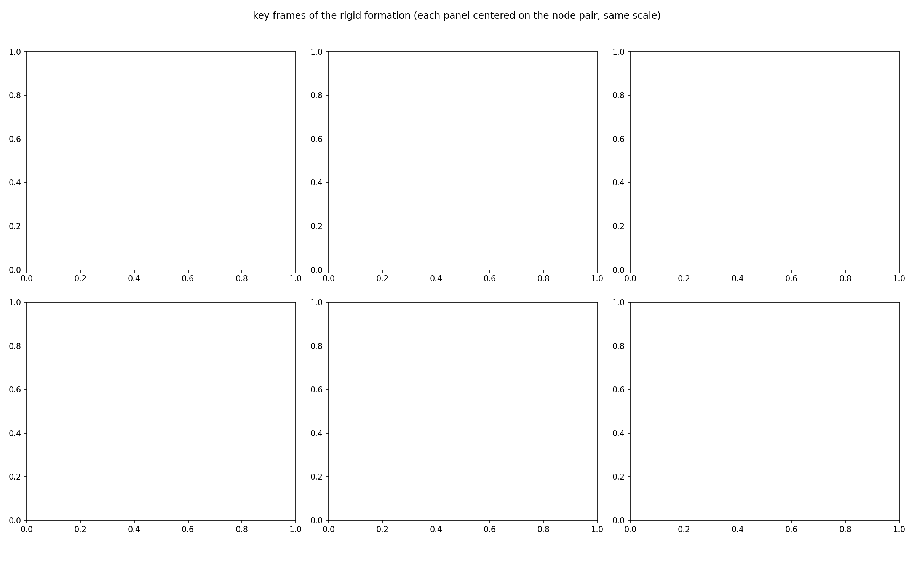
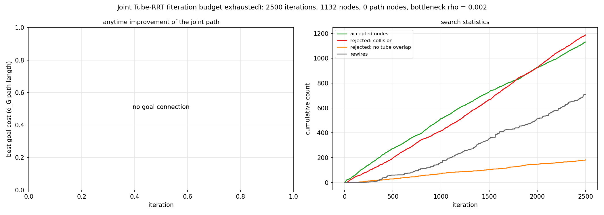

# Tube-RRT 运行记录：post_fence / seed 7 / square_first_goal

- 运行时间：2026-09-26 16:10:38
- 代码版本：`c4b567c (有未提交改动)`
- 结果目录：`results/tube_rrt/post_fence_seed7/square_first_goal`

复现命令（在仓库根目录执行）：

```bash
MPLBACKEND=Agg ../env/bin/python scripts/visualize_tube_rrt.py --map post_fence --seed 7
```

## 结果

| 项目 | 值 |
| --- | --- |
| 是否成功 | 否：iteration budget exhausted |
| 执行迭代数 | 2500 / 2500 |
| 首次连到目标的迭代 | - |
| 树节点数（含目标节点） | 1132（目标节点 0） |
| 被拒绝：碰撞 / 安全球不重叠 | 1187 / 182 |
| rewire 次数 | 708 |
| 步长回退后才接受的节点数 | 339 |
| 障碍夹在机器人之间的节点：树 / 路径 | 0 / 0（路径共 0 个节点） |
| 路径代价（含 J_margin）：首次 → 最终 | - → - |
| 路径 d_G 长度 | - |
| tube 瓶颈 rho_min | 0.002 |

## 配置

| 参数 | 值 |
| --- | --- |
| 地图 | post_fence, seed 7 |
| 编队 | square × 1（R_F = 0.354 m，相邻机器人最小间距 0.500 m） |
| 机器人半径 / 安全余量 | 0.113 m（TurtleBot3 Burger 外接圆） / 0.060 m |
| 障碍半径 | 0.080–0.080 m（设置：地图默认，共 7 个） |
| 能从相邻机器人之间穿过的障碍半径上限 | 0.077 m（= 最宽相邻间距/2 − 机器人半径 − 安全余量；小于它的障碍 0/7 个） |
| max_iterations | 2500 |
| metric_step | 0.45 |
| neighbor_radius | 1.2 |
| goal_bias | 0.12 |
| goal_connect_distance | 0.8 |
| seed | 7 |
| safety_margin | 0.0 |
| progress_interval | 500 |
| stop_on_first_goal | True |
| step_backoff | True |
| min_metric_step | 0.02 |
| margin_weight | 0.0 |

## 耗时

| 阶段 | 秒 |
| --- | --- |
| startup_imports | 0.865 |
| map_build | 0.582 |
| tube_rrt | 1.844 |
| plot_build | 136.302 |
| save | 5.198 |
| total | 144.804 |

## 图

### overview.png

总览：搜索树、joint tube、编队投影、tube 宽度四宫格



### 1_tree.png

最终搜索树 (x, y) 投影，颜色 = 节点插入顺序，短线 = yaw；叠加被拒绝的 steer 点、rewire 移除的边，粉色圈 = 障碍夹在机器人之间的节点



### 2_growth.png

由 trace 回放的树生长快照：sample、nearest、q_new 及其安全球 xy 截面



### 3_tube.png

joint tube：安全球 xy 截面、SE(2) 双锥、rho 沿路径曲线、相邻球严格重叠检查



### 4_formation.png

沿路径等间距采样的编队姿态：每个姿态一种颜色并编号，轮廓线连接各机器人（粉色填充 = 障碍夹在机器人之间）；机器人轨迹、瓶颈处 r + margin + rho 圆，以及 theta 曲线



### 5_formation_frames.png

关键帧放大：障碍夹在机器人之间（或瓶颈）附近的连续 tube 节点；每个子图以“上一节点 + 当前节点”为中心、比例尺相同，虚线为上一节点姿态，黑箭头为中心位移



### 6_convergence.png

最优路径代价随迭代下降曲线，以及节点 / 拒绝 / rewire 累计数



## 其他文件

- `path.csv`：联合路径节点（cx, cy, theta, rho）及各机器人投影坐标。
- `summary.json`：本次运行的机器可读摘要，`results/tube_rrt/README.md` 索引由它生成。

## 控制台输出

```text
timing startup_imports=0.865s
timing map_build=0.582s
geometry robot_radius=0.113 safety_margin=0.060 pass_through_bound=0.077 obstacle_radius=0.080-0.080 passable_obstacles=0/7
note: every obstacle is larger than the pass-through bound, so none can pass between robots (try --obstacle-radius auto or a larger --slot-scale)
planning...
progress iteration=500/2500 accepted_nodes=274 best_goal_distance=5.464
progress iteration=1000/2500 accepted_nodes=516 best_goal_distance=5.145
progress iteration=1500/2500 accepted_nodes=731 best_goal_distance=5.145
progress iteration=2000/2500 accepted_nodes=928 best_goal_distance=5.117
progress iteration=2500/2500 accepted_nodes=1132 best_goal_distance=5.117
search failed iteration budget exhausted iteration=2500/2500 accepted_nodes=1132 best_goal_distance=5.117
timing tube_rrt=1.844s
planning result: success=False iterations=2500 nodes=1132 path_nodes=0 path_cost=0.000 tube_bottleneck=0.002
timing plot_build=136.302s
timing save=5.198s total=144.804s
saved results/tube_rrt/post_fence_seed7/square_first_goal/
```
