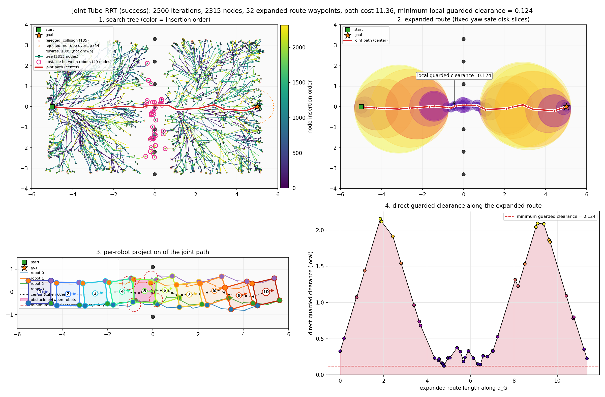
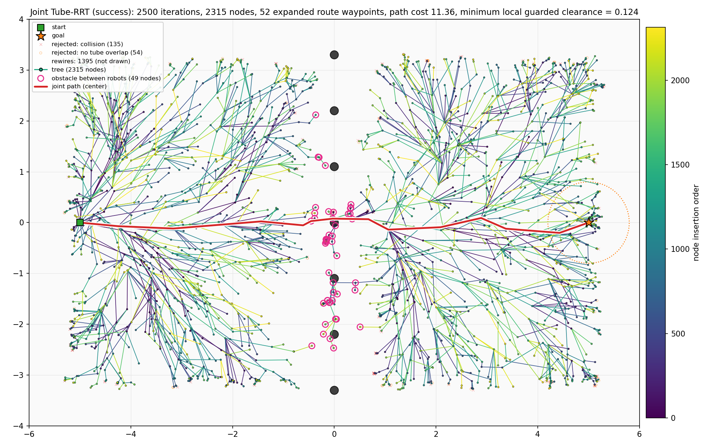
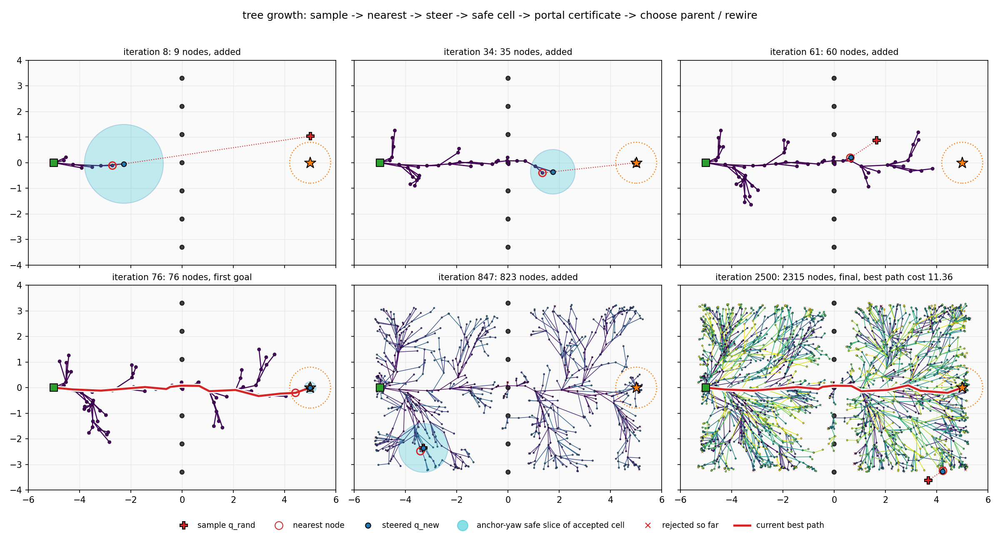
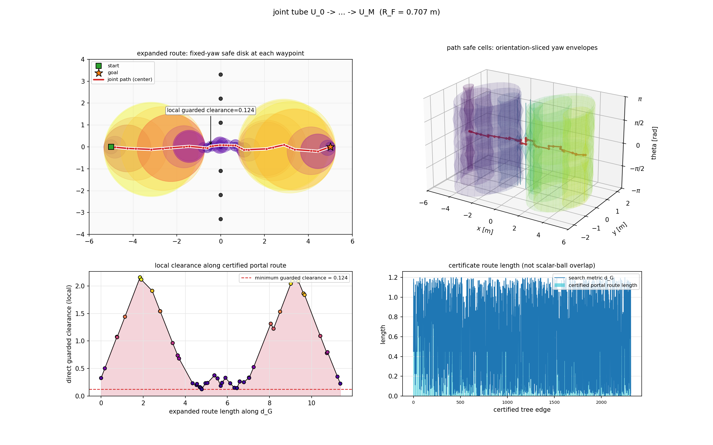
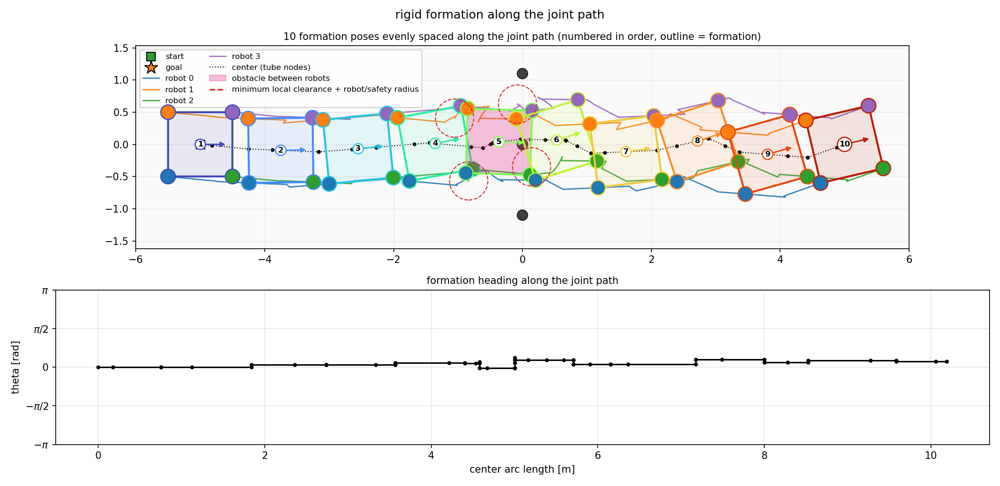
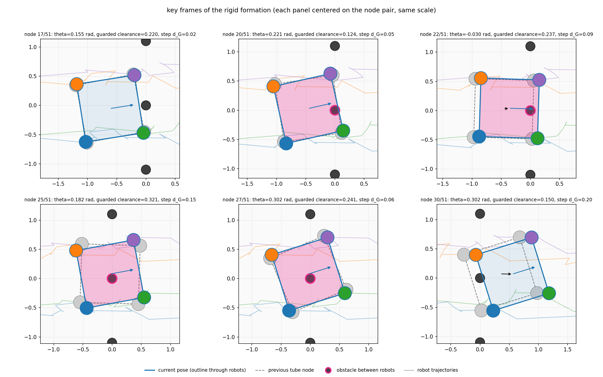
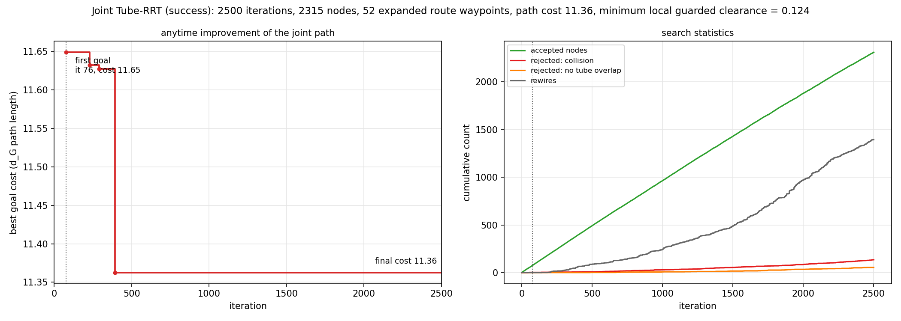

# Tube-RRT 运行记录：post_fence / seed 7 / square_x2_anytime_it2500

- 运行时间：2026-09-27 14:24:10
- 代码版本：`767aa3f (有未提交改动)`
- 结果目录：`results/tube_rrt/post_fence_seed7/square_x2_anytime_it2500`

复现命令（在仓库根目录执行）：

```bash
MPLBACKEND=Agg ../env/bin/python scripts/visualize_tube_rrt.py --map post_fence --seed 7 --slot-scale 2 --anytime
```

## 结果

| 项目 | 值 |
| --- | --- |
| 是否成功 | 是 |
| 执行迭代数 | 2500 / 2500 |
| 首次连到目标的迭代 | 76 |
| 树节点数（含目标节点） | 2315（目标节点 3） |
| 被拒绝：碰撞 / 安全球不重叠 | 135 / 54 |
| rewire 次数 | 1395 |
| 步长回退后才接受的节点数 | 614 |
| 障碍夹在机器人之间的节点：树 / 路径 | 49 / 12（路径共 52 个节点） |
| 路径代价（含 J_margin）：首次 → 最终 | 11.649 → 11.363 |
| 路径 d_G 长度 | 11.363 |
| tube minimum local guarded clearance | 0.124 |

## 配置

| 参数 | 值 |
| --- | --- |
| 地图 | post_fence, seed 7 |
| 编队 | square × 2（R_F = 0.707 m，相邻机器人最小间距 1.000 m） |
| 机器人半径 / 安全余量 | 0.113 m（TurtleBot3 Burger 外接圆） / 0.060 m |
| 障碍半径 | 0.080–0.080 m（设置：地图默认，共 7 个） |
| 能从相邻机器人之间穿过的障碍半径上限 | 0.327 m（= 最宽相邻间距/2 − 机器人半径 − 安全余量；小于它的障碍 7/7 个） |
| max_iterations | 2500 |
| metric_step | 0.45 |
| neighbor_radius | 1.2 |
| goal_bias | 0.12 |
| goal_connect_distance | 0.8 |
| seed | 7 |
| safety_margin | 0.0 |
| progress_interval | 500 |
| stop_on_first_goal | False |
| step_backoff | True |
| min_metric_step | 0.02 |
| margin_weight | 0.0 |
| yaw_slices | 16 |
| cell_eta | 0.98 |
| yaw_slice_count | None |
| cell_shrink | None |

## 耗时

| 阶段 | 秒 |
| --- | --- |
| startup_imports | 0.860 |
| map_build | 0.549 |
| tube_rrt | 3.909 |
| plot_build | 144.094 |
| save | 10.029 |
| total | 159.452 |

## 图

### overview.png

总览：搜索树、joint tube、编队投影、tube 宽度四宫格



### 1_tree.png

最终搜索树 (x, y) 投影，颜色 = 节点插入顺序，短线 = yaw；叠加被拒绝的 steer 点、rewire 移除的边，粉色圈 = 障碍夹在机器人之间的节点



### 2_growth.png

由 trace 回放的树生长快照：sample、nearest、q_new 及其安全 cell anchor-yaw 截面。



### 3_tube.png

joint tube：orientation-sliced safe cell disks and certified portal routes



### 4_formation.png

沿路径等间距采样的编队姿态：每个姿态一种颜色并编号，轮廓线连接各机器人（粉色填充 = 障碍夹在机器人之间）；机器人轨迹、局部 guarded clearance 圆



### 5_formation_frames.png

关键帧放大：障碍夹在机器人之间（或瓶颈）附近的连续 tube 节点；每个子图以“上一节点 + 当前节点”为中心、比例尺相同，虚线为上一节点姿态，黑箭头为中心位移



### 6_convergence.png

最优路径代价随迭代下降曲线，以及节点 / 拒绝 / rewire 累计数



## 其他文件

- `path.csv`：展开后的联合安全路线（cx, cy, theta, guarded_clearance）及各机器人投影坐标。
- `summary.json`：本次运行的机器可读摘要，`results/tube_rrt/README.md` 索引由它生成。

## 控制台输出

```text
timing startup_imports=0.860s
timing map_build=0.549s
geometry robot_radius=0.113 safety_margin=0.060 pass_through_bound=0.327 obstacle_radius=0.080-0.080 passable_obstacles=7/7
planning...
goal connected iteration=76 accepted_nodes=76
progress iteration=500/2500 accepted_nodes=495 best_goal_distance=0.000 best_cost=11.363
progress iteration=1000/2500 accepted_nodes=968 best_goal_distance=0.000 best_cost=11.363
progress iteration=1500/2500 accepted_nodes=1434 best_goal_distance=0.000 best_cost=11.363
progress iteration=2000/2500 accepted_nodes=1886 best_goal_distance=0.000 best_cost=11.363
progress iteration=2500/2500 accepted_nodes=2315 best_goal_distance=0.000 best_cost=11.363
search finished iteration=2500 accepted_nodes=2315 goal_nodes=3 best_cost=11.363
timing tube_rrt=3.909s
planning result: success=True iterations=2500 nodes=2315 path_nodes=52 path_cost=11.363 min_guarded_clearance=0.124
timing plot_build=144.094s
timing save=10.029s total=159.452s
saved results/tube_rrt/post_fence_seed7/square_x2_anytime_it2500/
```
