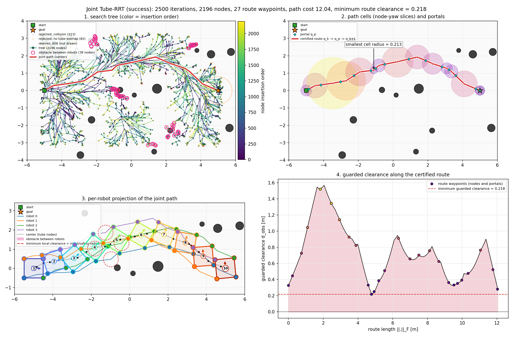
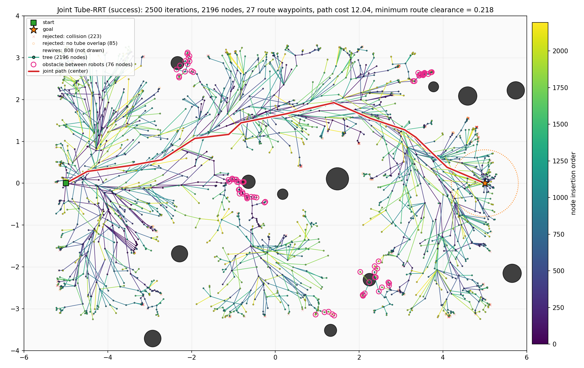
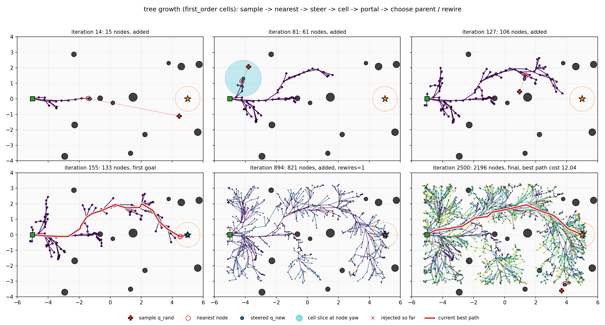
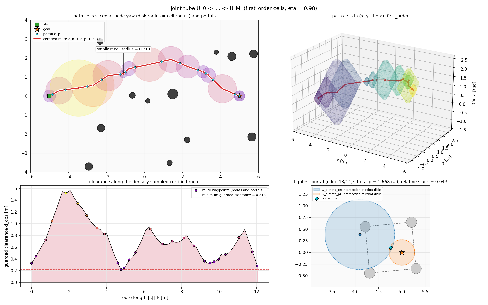
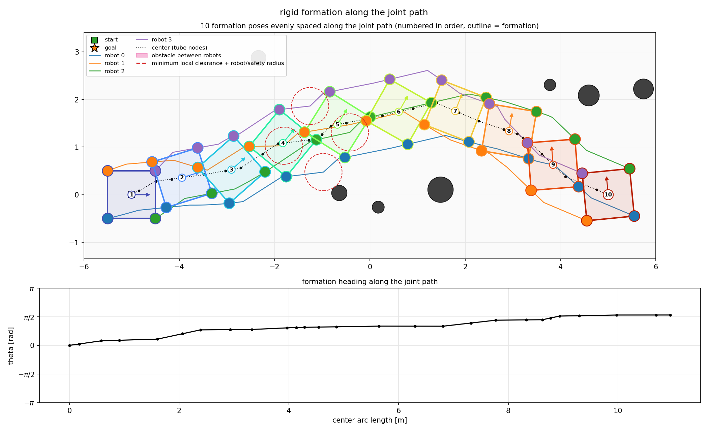
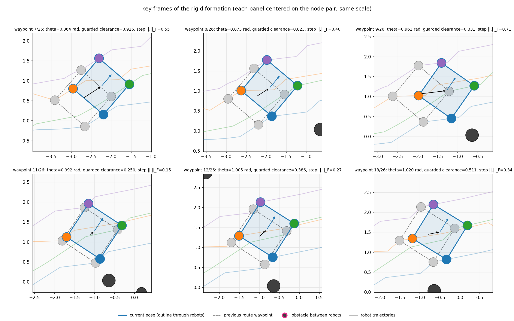
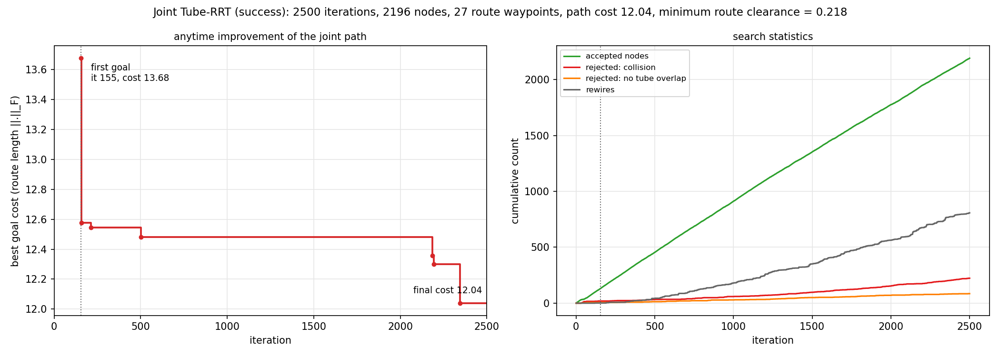

# Tube-RRT 运行记录：random_circles / seed 7 / square_cell1_x2_anytime_it2500

- 运行时间：2026-09-28 17:32:30
- 代码版本：`be68102 (有未提交改动)`
- 结果目录：`results/tube_rrt/random_circles_seed7/square_cell1_x2_anytime_it2500`

复现命令（在仓库根目录执行）：

```bash
MPLBACKEND=Agg ../env-rebuilt/bin/python scripts/visualize_tube_rrt.py --cell first_order --anytime --progress-interval 0 --slot-scale 2
```

## 结果

| 项目 | 值 |
| --- | --- |
| 是否成功 | 是 |
| 执行迭代数 | 2500 / 2500 |
| 首次连到目标的迭代 | 155 |
| 树节点数（含目标节点） | 2196（目标节点 3） |
| 被拒绝：碰撞 / cell 不重叠 | 223 / 85 |
| rewire 次数 | 808 |
| 步长回退后才接受的节点数 | 889 |
| 障碍夹在机器人之间的节点：树 / 路径 | 76 / 0（路线共 27 个航点，含 portal） |
| 路径代价（含 J_margin）：首次 → 最终 | 13.676 → 12.040 |
| 路线长度 ||.||_F | 12.031 |
| 认证路线上稠密采样的最小 guarded clearance（<0 表示碰撞） | 0.218 |
| overlap 判定：总数 / 快速拒绝 / 快速接受 / SOCP（接受） | 13203 / 0 / 0 / 0（0） |

## 配置

| 参数 | 值 |
| --- | --- |
| cell | 一阶近似 cell：max_i ||u + J a_i phi|| < rho_k，rho_k = eta d_obs；overlap 用同 chart 位似判据的推广 rho_a/n_a + rho_b/n_b > 1（portal 在两节点连线上） |
| 地图 | random_circles, seed 7 |
| 编队 | square × 2（R_F = 0.707 m，相邻机器人最小间距 1.000 m） |
| 机器人半径 / 安全余量 | 0.113 m（TurtleBot3 Burger 外接圆） / 0.060 m |
| 障碍半径 | 0.121–0.267 m（设置：地图默认，共 12 个） |
| 能从相邻机器人之间穿过的障碍半径上限 | 0.327 m（= 最宽相邻间距/2 − 机器人半径 − 安全余量；小于它的障碍 12/12 个） |
| max_iterations | 2500 |
| metric_step | 0.45 |
| neighbor_radius | 1.2 |
| goal_bias | 0.12 |
| goal_connect_distance | 0.8 |
| seed | 7 |
| safety_margin | 0.0 |
| progress_interval | 0 |
| stop_on_first_goal | False |
| step_backoff | True |
| min_metric_step | 0.02 |
| margin_weight | 0.0 |
| cell_model | first_order |
| cell_eta | 0.98 |
| route_check_step | 0.02 |

## 耗时

| 阶段 | 秒 |
| --- | --- |
| startup_imports | 0.214 |
| map_build | 0.086 |
| tube_rrt | 0.327 |
| plot_build | 1.624 |
| save | 1.300 |
| total | 3.552 |

## 图

### overview.png

总览：搜索树、joint tube、编队投影、tube 宽度四宫格



### 1_tree.png

最终搜索树 (x, y) 投影，颜色 = 节点插入顺序，短线 = yaw；叠加被拒绝的 steer 点、rewire 移除的边，粉色圈 = 障碍夹在机器人之间的节点



### 2_growth.png

由 trace 回放的树生长快照：sample、nearest、q_new 及其 cell 在节点 yaw 处的 xy 截面



### 3_tube.png

joint tube：路径 cell 的节点 yaw 截面与 portal、(x, y, theta) 中的 cell 形状、沿认证路线的稠密 clearance、最紧 portal 处两个 cell 的固定 yaw 截面（圆盘交集）



### 4_formation.png

沿路径等间距采样的编队姿态：每个姿态一种颜色并编号，轮廓线连接各机器人（粉色填充 = 障碍夹在机器人之间）；机器人轨迹、局部 guarded clearance 圆



### 5_formation_frames.png

关键帧放大：障碍夹在机器人之间（或瓶颈）附近的连续 tube 节点；每个子图以“上一节点 + 当前节点”为中心、比例尺相同，虚线为上一节点姿态，黑箭头为中心位移



### 6_convergence.png

最优路径代价随迭代下降曲线，以及节点 / 拒绝 / rewire 累计数



## 其他文件

- `path.csv`：认证路线 q_0 -> portal -> q_1 -> ... 的航点（cx, cy, theta, guarded_clearance）及各机器人投影坐标。
- `summary.json`：本次运行的机器可读摘要，`results/tube_rrt/README.md` 索引由它生成。

## 控制台输出

```text
timing startup_imports=0.214s
timing map_build=0.086s
geometry robot_radius=0.113 safety_margin=0.060 pass_through_bound=0.327 obstacle_radius=0.121-0.267 passable_obstacles=12/12
planning...
timing tube_rrt=0.327s
planning result: success=True iterations=2500 nodes=2196 path_nodes=27 path_cost=12.040 route_min_clearance=0.218
overlap overlap_calls=13203 quick_reject=0 quick_accept=0 socp_calls=0 socp_accept=0
timing plot_build=1.624s
timing save=1.300s total=3.552s
saved results/tube_rrt/random_circles_seed7/square_cell1_x2_anytime_it2500/
```
