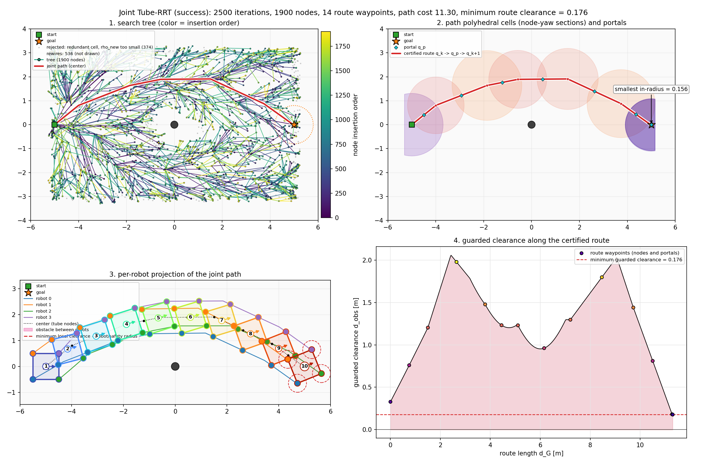
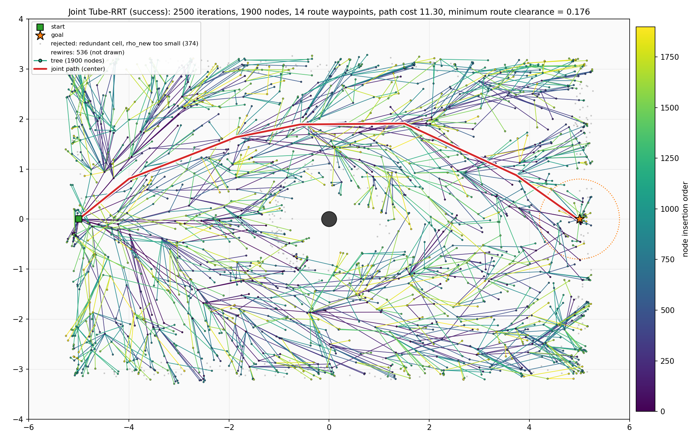
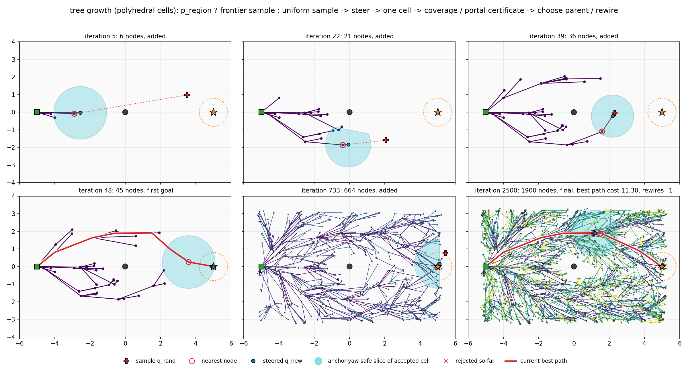
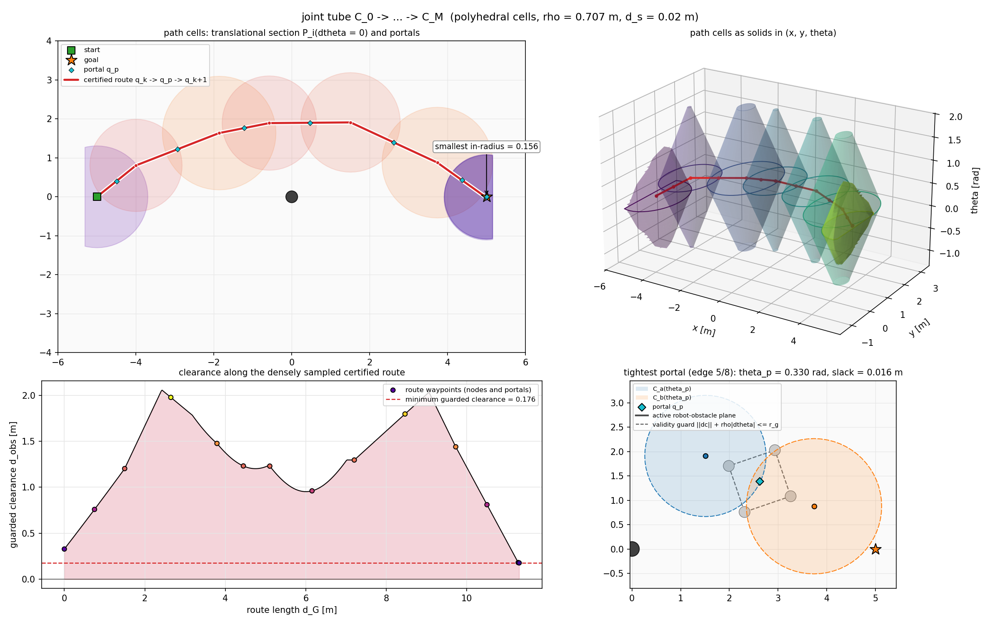
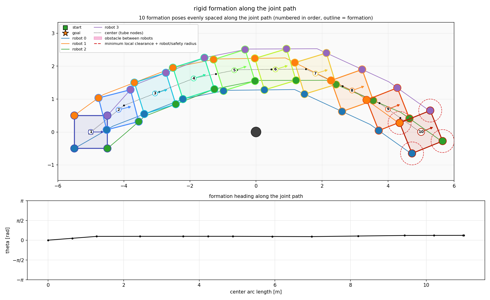
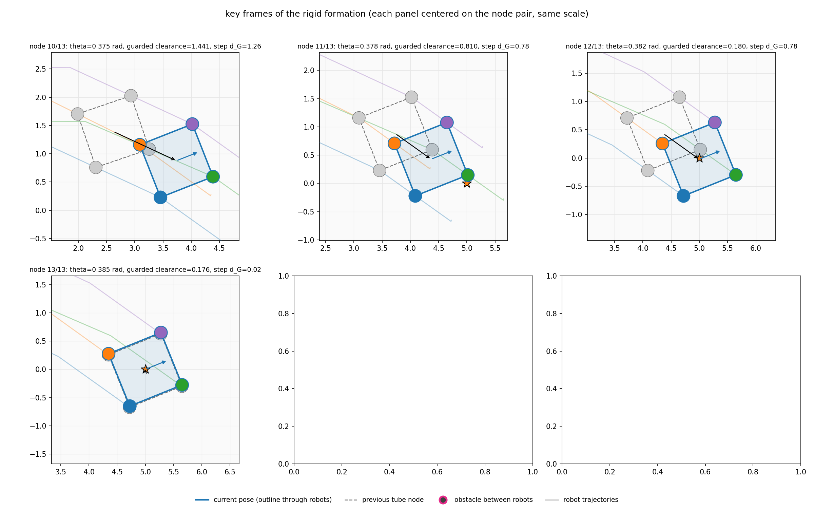
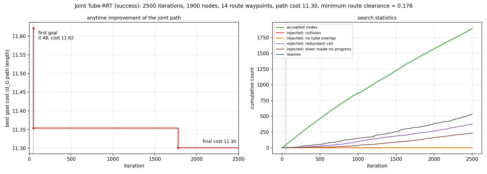
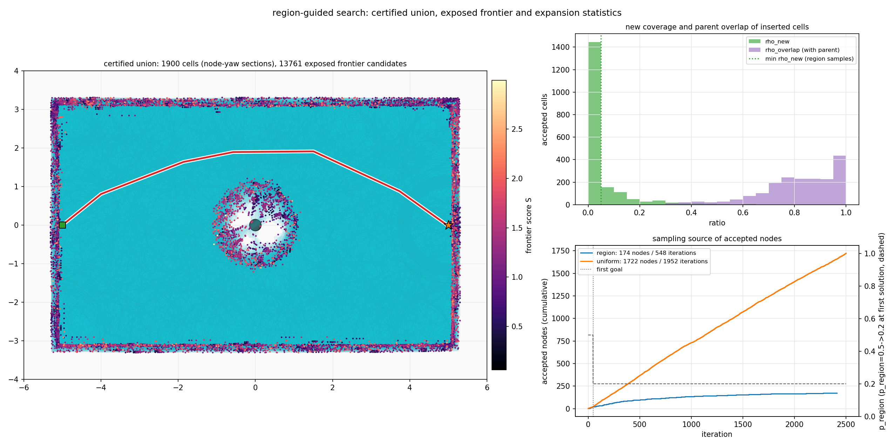
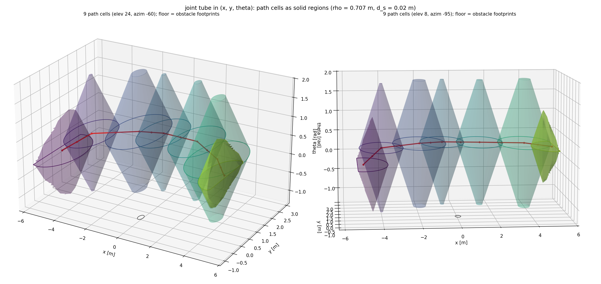

# Tube-RRT 运行记录：single_post / seed 7 / square_cellP_x2_anytime_it2500

- 运行时间：2026-09-30 09:54:21
- 代码版本：`f36dc0c (有未提交改动)`
- 结果目录：`results/tube_rrt/single_post_seed7/square_cellP_x2_anytime_it2500`

复现命令（在仓库根目录执行）：

```bash
MPLBACKEND=Agg ../env-rebuilt/bin/python scripts/visualize_tube_rrt.py --map single_post --formation square --slot-scale 2 --cell polyhedral --anytime --iterations 2500 --progress-interval 0
```

## 结果

| 项目 | 值 |
| --- | --- |
| 是否成功 | 是 |
| 执行迭代数 | 2500 / 2500 |
| 首次连到目标的迭代 | 48 |
| 树节点数（含目标节点） | 1900（目标节点 3） |
| 被拒绝：碰撞 / 安全球不重叠 | 0 / 0 |
| rewire 次数 | 536 |
| 步长回退后才接受的节点数 | 0 |
| 障碍夹在机器人之间的节点：树 / 路径 | 0 / 0（路径共 14 个节点） |
| 路径代价（含 J_margin）：首次 → 最终 | 11.621 → 11.302 |
| 路径 d_G 长度 | 11.302 |
| 认证路线上稠密采样的最小 guarded clearance（<0 表示碰撞） | 0.176 |
| T_first / C_first / 首解前 N_query | 0.036 s / 11.621 / 49 |
| 总规划时间 / N_query（位姿 proximity 查询 = 构造 cell 数） / robot-obstacle 距离对 | 3.16 s / 2271 / 45420 |
| overlap 判定：总数 / 快速拒绝 / 快速接受 / 方向部分 LP（拒绝 / 接受） / 含 guard SOCP（接受） | 4611 / 0 / 3895 / 716（37 / 244） / 435（358） |
| 被拒绝：region 冗余 cell（rho_new 过小） / steer 无进展 | 374 / 230 |
| 采样通道 region / uniform：迭代数（region 无候选回退） | 548 / 1952（0） |
| 采样通道 region / uniform：接受节点数 | 174 / 1722 |
| frontier 候选：生成 / 被覆盖 / 多次失败丢弃 / 结束时仍 exposed | 27307 / 13546 / 0 / 13761 |
| 每个 cell 平均：broadphase pair / 边界 active row | 1.76 / 0.98 |

## 配置

| 参数 | 值 |
| --- | --- |
| cell | polyhedral cell + region/uniform 混合 RRT*：两级 active pair（broadphase d < d_active，再只留真正边界行、近平行只留更紧者）的支撑平面 n^T dc - rho|dtheta| >= -(d - d_s)，validity guard ||dc|| + rho|dtheta| <= r_g 作为谓词，yaw 区间由约束决定（<= pi/2 chart）；每次迭代以 p_region 从 exposed frontier 按 S = alpha l + beta U + gamma G 采样，否则 uniform SE(2) 采样，只构造 1 个 cell |
| 地图 | single_post, seed 7 |
| 编队 | square × 2（R_F = 0.707 m，相邻机器人最小间距 1.000 m） |
| 机器人半径 / 安全余量 | 0.113 m（TurtleBot3 Burger 外接圆） / 0.060 m |
| 障碍半径 | 0.150–0.150 m（设置：地图默认，共 1 个） |
| 能从相邻机器人之间穿过的障碍半径上限 | 0.327 m（= 最宽相邻间距/2 − 机器人半径 − 安全余量；小于它的障碍 1/1 个） |
| max_iterations | 2500 |
| metric_step | 0.45 |
| neighbor_radius | 1.2 |
| goal_bias | 0.12 |
| goal_connect_distance | 0.8 |
| seed | 7 |
| safety_margin | 0.0 |
| progress_interval | 0 |
| stop_on_first_goal | False |
| step_backoff | True |
| min_metric_step | 0.02 |
| margin_weight | 0.0 |
| yaw_slices | 16 |
| cell_eta | 0.98 |
| yaw_slice_count | None |
| cell_shrink | None |
| cell_model | polyhedral |
| route_check_step | 0.02 |
| frontier.safety_distance | 0.02 |
| frontier.active_range | 1.0 |
| frontier.parallel_tolerance | 0.08726646259971647 |
| frontier.max_extent | 1.5 |
| frontier.yaw_chart | 1.5707963267948966 |
| frontier.cell_samples | 128 |
| frontier.region_schedule | switch |
| frontier.region_probability | 0.4 |
| frontier.region_before | 0.5 |
| frontier.region_after | 0.2 |
| frontier.region_max | 0.5 |
| frontier.region_min | 0.2 |
| frontier.region_decay | 0.002 |
| frontier.yaw_slice_fractions | (0.0, -0.45, 0.45, -0.85, 0.85) |
| frontier.frontier_directions | 16 |
| frontier.probe_step | 0.25 |
| frontier.probe_count | 3 |
| frontier.obstacle_edge_weight | 0.3 |
| frontier.score_weights | (1.0, 1.0, 1.0) |
| frontier.score_temperature | 0.15 |
| frontier.length_ref | 1.0 |
| frontier.sample_offset | 0.1 |
| frontier.steer_fraction | 0.9 |
| frontier.min_new_ratio | 0.05 |
| frontier.overlap_band | (0.1, 0.5) |
| frontier.max_candidate_failures | 3 |
| frontier.max_parent_candidates | 12 |

## 耗时

| 阶段 | 秒 |
| --- | --- |
| startup_imports | 0.224 |
| map_build | 0.081 |
| tube_rrt | 3.164 |
| plot_build | 1.382 |
| save | 2.644 |
| total | 7.497 |

## 图

### overview.png

总览：搜索树、joint tube、编队投影、tube 宽度四宫格



### 1_tree.png

最终搜索树 (x, y) 投影，颜色 = 节点插入顺序，短线 = yaw；叠加被拒绝的 steer 点、rewire 移除的边，粉色圈 = 障碍夹在机器人之间的节点



### 2_growth.png

由 trace 回放的树生长快照：sample、nearest、q_new 及其安全 cell anchor-yaw 截面。



### 3_tube.png

joint tube：路径 polyhedral cell 的 dtheta = 0 截面 P_i(0) 与 portal、(x, y, theta) 中的 cell 三维实体（半透明曲面 + yaw chart 截断处的平顶）、沿认证路线的稠密 clearance、最紧 portal 处两个 cell 在 portal yaw 下的截面（实线边 = active 障碍支撑平面，虚线边 = validity guard）



### 4_formation.png

沿路径等间距采样的编队姿态：每个姿态一种颜色并编号，轮廓线连接各机器人（粉色填充 = 障碍夹在机器人之间）；机器人轨迹、局部 guarded clearance 圆



### 5_formation_frames.png

关键帧放大：障碍夹在机器人之间（或瓶颈）附近的连续 tube 节点；每个子图以“上一节点 + 当前节点”为中心、比例尺相同，虚线为上一节点姿态，黑箭头为中心位移



### 6_convergence.png

最优路径代价随迭代下降曲线，以及节点 / 拒绝 / rewire 累计数



### 7_frontier.png

（仅 polyhedral）certified union：全部 cell 的节点 yaw 截面、仍 exposed 的 frontier 候选（颜色 = 采样分数 S）；新 cell 的 rho_new / rho_overlap 分布；region 与 uniform 两个采样通道的累计接受节点数及 p_region 调度（虚线）



### 8_tube_3d.png

（仅 polyhedral）路径 cell 在 (x, y, theta) 中的三维实体，两个视角：每个 cell 是 S_0 被 rho|dtheta| 腐蚀后堆起来的双锥体（yaw chart 截断时有平顶），底面为障碍投影，红线为认证路线



## 其他文件

- `path.csv`：展开后的联合安全路线（cx, cy, theta, guarded_clearance）及各机器人投影坐标。
- `summary.json`：本次运行的机器可读摘要，`results/tube_rrt/README.md` 索引由它生成。

## 控制台输出

```text
timing startup_imports=0.224s
timing map_build=0.081s
geometry robot_radius=0.113 safety_margin=0.060 pass_through_bound=0.327 obstacle_radius=0.150-0.150 passable_obstacles=1/1
planning...
timing tube_rrt=3.164s
planning result: success=True iterations=2500 nodes=1900 path_nodes=14 path_cost=11.302 min_guarded_clearance=0.176
overlap cells_built=2271 pose_queries=2271 pair_queries=45420 broadphase_pairs=3995 active_pairs=2215 overlap_calls=4611 quick_reject=0 quick_accept=3895 lp_calls=716 lp_reject=37 lp_accept=244 socp_calls=435 socp_accept=358 region_iterations=548 uniform_iterations=1952 region_nodes=174 uniform_nodes=1722 region_fallback=0 frontier_candidates=27307 frontier_covered=13546 frontier_dropped=0 rejected_redundant=374 rejected_no_progress=230 rejected_no_overlap=0 first_goal_time_s=0.03639939799904823 first_goal_pose_queries=49 first_goal_cost=11.620705388303028 frontier_alive=13761 plan_time_s=3.1621507280506194
timing plot_build=1.382s
timing save=2.644s total=7.497s
saved results/tube_rrt/single_post_seed7/square_cellP_x2_anytime_it2500/
```
