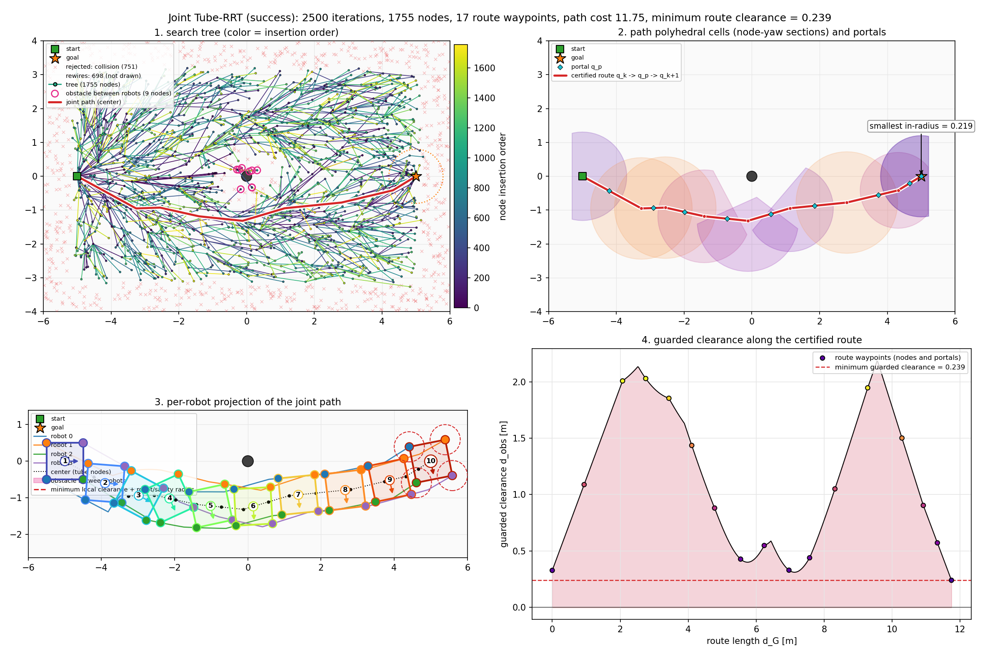
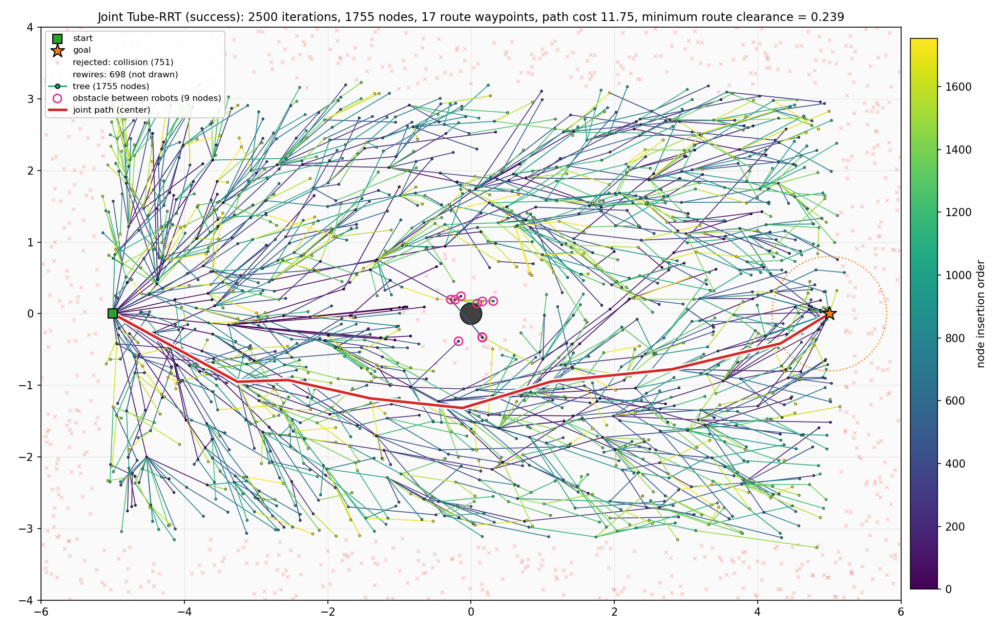
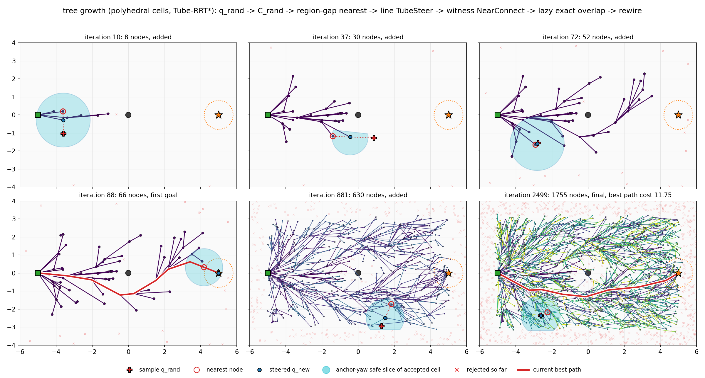
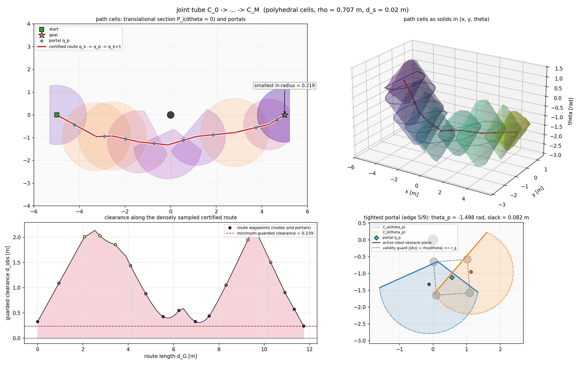
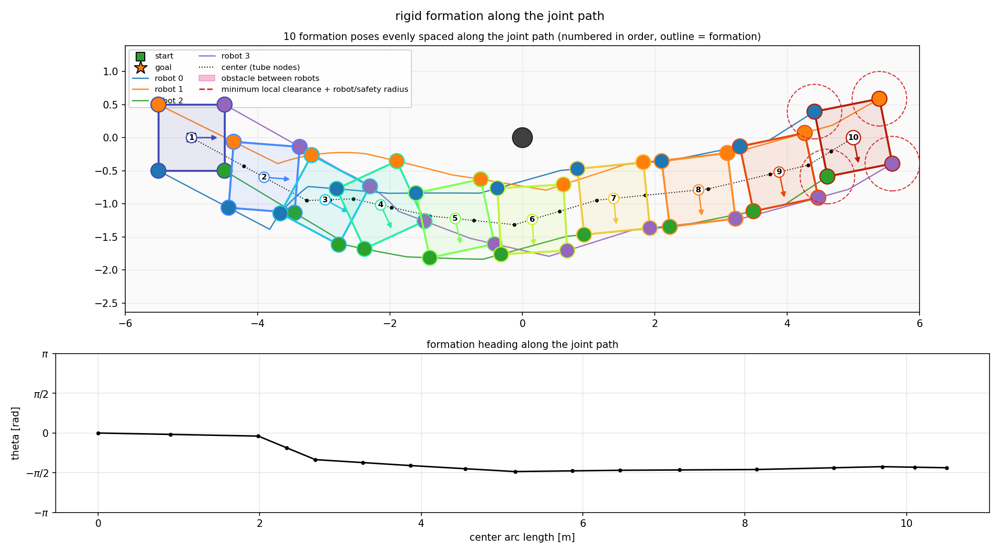
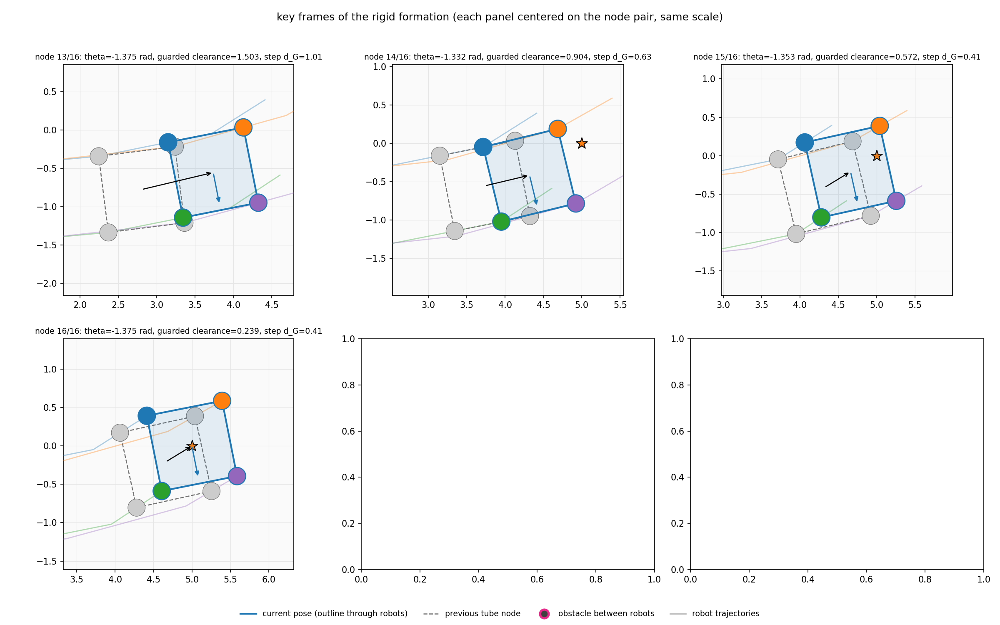
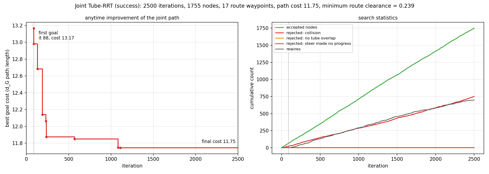
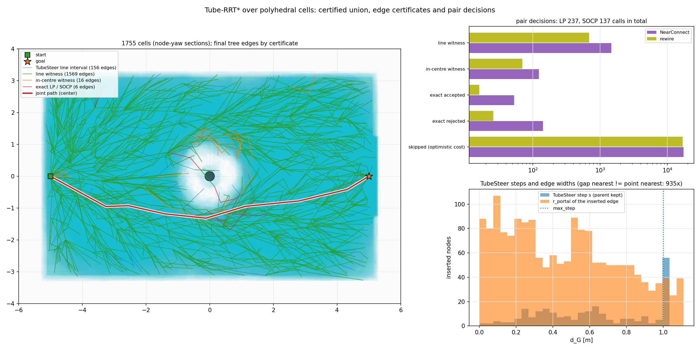
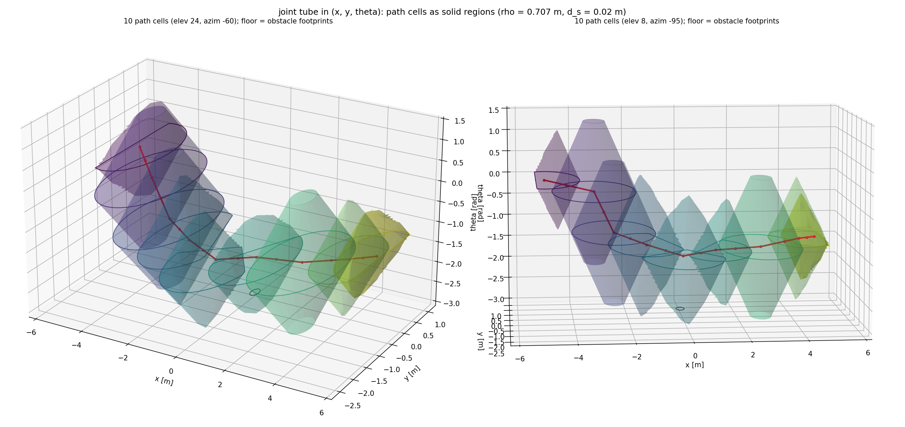

# Tube-RRT 运行记录：single_post / seed 7 / square_cellT_x2_anytime_it2500

- 运行时间：2026-09-30 14:14:19
- 代码版本：`b887b1c (有未提交改动)`
- 结果目录：`results/tube_rrt/single_post_seed7/square_cellT_x2_anytime_it2500`

复现命令（在仓库根目录执行）：

```bash
MPLBACKEND=Agg ../env-rebuilt/bin/python scripts/visualize_tube_rrt.py --map single_post --formation square --slot-scale 2 --cell polyhedral_tube --anytime --iterations 2500 --progress-interval 0
```

## 结果

| 项目 | 值 |
| --- | --- |
| 是否成功 | 是 |
| 执行迭代数 | 2500 / 2500 |
| 首次连到目标的迭代 | 88 |
| 树节点数（含目标节点） | 1755（目标节点 7） |
| 被拒绝：碰撞 / 安全球不重叠 | 751 / 0 |
| rewire 次数 | 698 |
| 步长回退后才接受的节点数 | 11 |
| 障碍夹在机器人之间的节点：树 / 路径 | 9 / 0（路径共 17 个节点） |
| 路径代价（含 J_margin）：首次 → 最终 | 13.166 → 11.746 |
| 路径 d_G 长度 | 11.746 |
| 认证路线上稠密采样的最小 guarded clearance（<0 表示碰撞） | 0.239 |
| T_first / C_first / 首解前 N_query | 0.031 s / 13.166 / 163 |
| 总规划时间 / N_query（位姿 proximity 查询 = 构造 cell 数） / robot-obstacle 距离对 | 0.79 s / 2898 / 57960 |
| q_rand 碰撞 / region-gap nearest 选中节点与点最近不同 / 选中节点 gap ≤ 0 | 751 / 935 / 1700 |
| TubeSteer：插入节点 / 首次即成功（直接用 C_rand） / 额外建 cell / 失败（无进展 / 碰撞 / 无公共区间） | 1747 / 1736 / 397 / 2 / 0 / 0 |
| NearConnect：直线 witness / 内切圆心 witness / 精确 LP-SOCP（接受） / 被乐观代价跳过 / 改进父节点 | 1465 / 123 / 195（53） / 17428 / 1549 |
| rewire：直线 witness / 内切圆心 witness / 精确 LP-SOCP（接受） / 被乐观代价跳过 / 实际 rewire | 686 / 70 / 42（16） / 16904 / 698 |
| LP / SOCP 调用总数 | 237 / 137 |
| 插入边的平均 r_portal | 0.461 m |
| 每个 cell 平均：broadphase pair / 边界 active row | 2.17 / 1.01 |

## 配置

| 参数 | 值 |
| --- | --- |
| cell | polyhedral cell + Tube-RRT*：q_rand ~ SE(2) 无碰撞则建 C_rand；region-gap nearest argmin D_i - l_i(u_i) - l_rand(-u_i)（l 为 cell 沿随机方向的解析径向长度）；沿 q_i + s u_i 做 line TubeSteer，新 cell 与父 cell 在该直线上的公共区间 >= w_min 即为 overlap witness（中点为 portal，两 cell 的 slack 最小值为 r_portal）；NearConnect / rewire 先用直线 witness、再用两 cell 内切圆心连线上的点，都没有且乐观代价 cost + D 仍可能改进时才解 LP / SOCP |
| 地图 | single_post, seed 7 |
| 编队 | square × 2（R_F = 0.707 m，相邻机器人最小间距 1.000 m） |
| 机器人半径 / 安全余量 | 0.113 m（TurtleBot3 Burger 外接圆） / 0.060 m |
| 障碍半径 | 0.150–0.150 m（设置：地图默认，共 1 个） |
| 能从相邻机器人之间穿过的障碍半径上限 | 0.327 m（= 最宽相邻间距/2 − 机器人半径 − 安全余量；小于它的障碍 1/1 个） |
| max_iterations | 2500 |
| metric_step | 0.45 |
| neighbor_radius | 1.2 |
| goal_bias | 0.12 |
| goal_connect_distance | 0.8 |
| seed | 7 |
| safety_margin | 0.0 |
| progress_interval | 0 |
| stop_on_first_goal | False |
| step_backoff | True |
| min_metric_step | 0.02 |
| margin_weight | 0.0 |
| yaw_slices | 16 |
| cell_eta | 0.98 |
| yaw_slice_count | None |
| cell_shrink | None |
| cell_model | polyhedral_tube |
| route_check_step | 0.02 |
| tube.safety_distance | 0.02 |
| tube.active_range | 1.0 |
| tube.parallel_tolerance | 0.08726646259971647 |
| tube.max_extent | 1.5 |
| tube.yaw_chart | 1.5707963267948966 |
| tube.cell_samples | 128 |
| tube.outer_reach | 0.5 |
| tube.nearest | gap |
| tube.min_witness | 0.05 |
| tube.steer_attempts | 3 |
| tube.steer_fraction | 0.9 |
| tube.max_step | 1.0 |
| tube.max_neighbors | 12 |
| tube.exact_overlap | True |
| tube.lazy_geometry | True |
| tube.colliding | drop |

## 耗时

| 阶段 | 秒 |
| --- | --- |
| startup_imports | 0.227 |
| map_build | 0.087 |
| tube_rrt | 0.796 |
| plot_build | 1.367 |
| save | 2.679 |
| total | 5.156 |

## 图

### overview.png

总览：搜索树、joint tube、编队投影、tube 宽度四宫格



### 1_tree.png

最终搜索树 (x, y) 投影，颜色 = 节点插入顺序，短线 = yaw；叠加被拒绝的 steer 点、rewire 移除的边，粉色圈 = 障碍夹在机器人之间的节点



### 2_growth.png

由 trace 回放的树生长快照：sample、nearest、q_new 及其安全 cell anchor-yaw 截面。



### 3_tube.png

joint tube：路径 polyhedral cell 的 dtheta = 0 截面 P_i(0) 与 portal、(x, y, theta) 中的 cell 三维实体（半透明曲面 + yaw chart 截断处的平顶）、沿认证路线的稠密 clearance、最紧 portal 处两个 cell 在 portal yaw 下的截面（实线边 = active 障碍支撑平面，虚线边 = validity guard）



### 4_formation.png

沿路径等间距采样的编队姿态：每个姿态一种颜色并编号，轮廓线连接各机器人（粉色填充 = 障碍夹在机器人之间）；机器人轨迹、局部 guarded clearance 圆



### 5_formation_frames.png

关键帧放大：障碍夹在机器人之间（或瓶颈）附近的连续 tube 节点；每个子图以“上一节点 + 当前节点”为中心、比例尺相同，虚线为上一节点姿态，黑箭头为中心位移



### 6_convergence.png

最优路径代价随迭代下降曲线，以及节点 / 拒绝 / rewire 累计数



### 7_region_tube.png

（仅 polyhedral_tube）全部 cell 的节点 yaw 截面与最终树边，边颜色 = 该边的认证方式（TubeSteer 直线区间 / NearConnect-rewire 的直线 witness / 内切圆心连线 witness / 精确 LP-SOCP）；NearConnect 与 rewire 各类判定次数（含被乐观代价跳过的）；TubeSteer 步长 s 与 r_portal 分布



### 8_tube_3d.png

（仅 polyhedral）路径 cell 在 (x, y, theta) 中的三维实体，两个视角：每个 cell 是 S_0 被 rho|dtheta| 腐蚀后堆起来的双锥体（yaw chart 截断时有平顶），底面为障碍投影，红线为认证路线



## 其他文件

- `path.csv`：展开后的联合安全路线（cx, cy, theta, guarded_clearance）及各机器人投影坐标。
- `summary.json`：本次运行的机器可读摘要，`results/tube_rrt/README.md` 索引由它生成。

## 控制台输出

```text
timing startup_imports=0.227s
timing map_build=0.087s
geometry robot_radius=0.113 safety_margin=0.060 pass_through_bound=0.327 obstacle_radius=0.150-0.150 passable_obstacles=1/1
planning...
timing tube_rrt=0.796s
planning result: success=True iterations=2500 nodes=1755 path_nodes=17 path_cost=11.746 min_guarded_clearance=0.239
overlap cells_built=2898 pose_queries=2898 pair_queries=57960 broadphase_pairs=6277 active_pairs=2918 overlap_calls=237 quick_reject=0 quick_accept=0 lp_calls=237 lp_reject=95 lp_accept=5 socp_calls=137 socp_accept=64 samples_colliding=751 gap_negative=1700 nearest_differs=935 steer_cells=397 steer_first_try=1736 rejected_no_progress=2 rejected_collision=0 rejected_no_overlap=0 parent_witness=1747 near_improved=1549 rewires=698 portal_radius_sum=805.3176999834318 near_witness=1465 near_center_witness=123 near_exact_calls=195 near_exact_accept=53 near_skipped_bound=17428 rewire_witness=686 rewire_center_witness=70 rewire_exact_calls=42 rewire_exact_accept=16 rewire_skipped_bound=16904 first_goal_time_s=0.03060123696923256 first_goal_pose_queries=163 first_goal_cost=13.16580191235511 tube_nodes=1747 portal_radius_mean=0.4609717801851355 plan_time_s=0.7941942710895091
timing plot_build=1.367s
timing save=2.679s total=5.156s
saved results/tube_rrt/single_post_seed7/square_cellT_x2_anytime_it2500/
```
